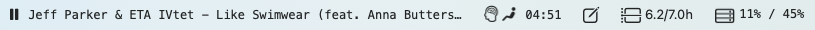
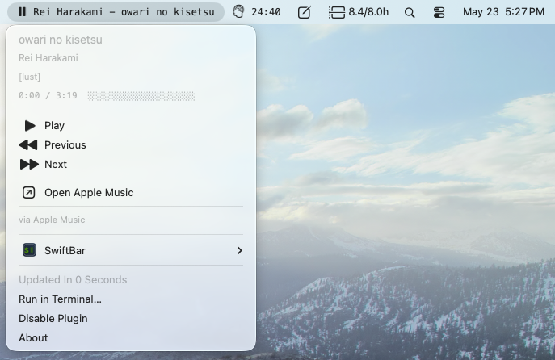
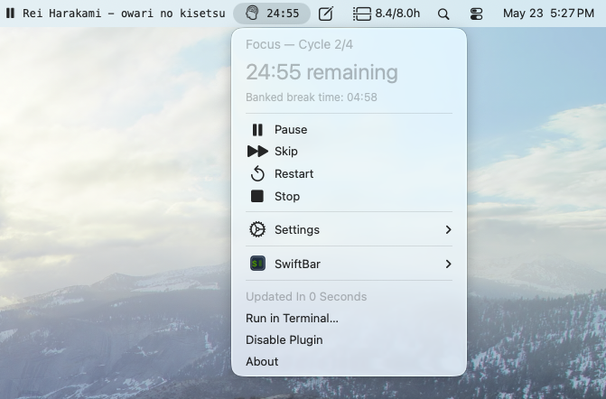
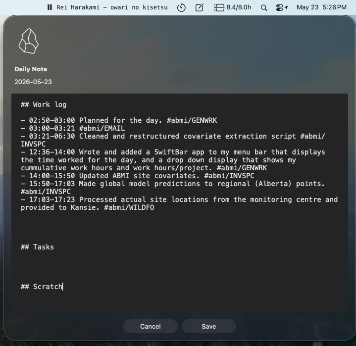
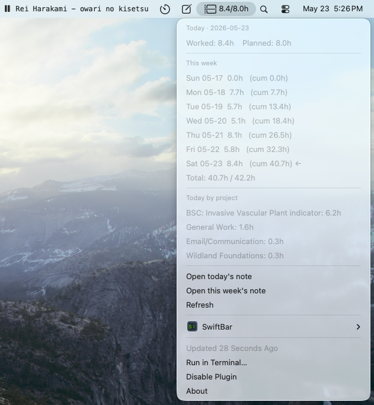
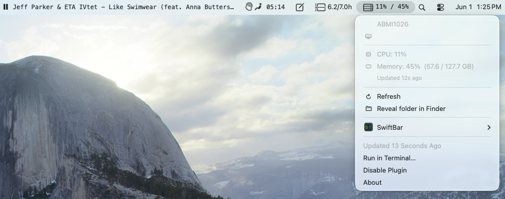

# macOS Menu Bar Apps


A small collection of [SwiftBar](https://github.com/swiftbar/SwiftBar) plugins for the macOS menu bar.



## Contents

- [Prerequisites](#prerequisites)
- [SwiftBar Now Playing Menu Bar Widget](#swiftbar-now-playing-menu-bar-widget)
- [SwiftBar Pomodoro Menu Bar Timer](#swiftbar-pomodoro-menu-bar-timer)
- [SwiftBar Obsidian Daily Note](#swiftbar-obsidian-daily-note)
- [SwiftBar Obsidian Work Hours](#swiftbar-obsidian-work-hours)
- [SwiftBar Remote PC Stats](#swiftbar-remote-pc-stats)


## Prerequisites

```sh
# Install SwiftBar
brew install --cask swiftbar

# Launch SwiftBar, then set a plugin directory when prompted (e.g. ~/swiftbar_plugins)
```

[obsidian_daily.30s.zsh](obsidian_daily.30s.zsh) and [obsidian_work_hours.30s.zsh](obsidian_work_hours.30s.zsh) pull and push data to my [Obsidian](https://github.com/obsidianmd) vault. 

---

## SwiftBar Now Playing Menu Bar Widget

Script: [now_playing.5s.zsh](now_playing.5s.zsh)

Displays the currently playing track in the menu bar with playback controls (play/pause, next, previous) and a dropdown showing title, artist, album, and a progress bar. Supports Spotify and Apple Music via AppleScript out of the box, and any audio source (browsers, Podcasts, etc.) when `nowplaying-cli` is installed.



```sh
# Symlink the plugin into your SwiftBar plugin directory
ln -s "$(pwd)/now_playing.5s.zsh" ~/swiftbar_plugins/
chmod +x now_playing.5s.zsh

# Optional: install nowplaying-cli for system-wide support (browsers, Podcasts, etc.)
brew install nowplaying-cli

# Required for the AppleScript fallback to parse track info
brew install jq

# CLI control (also available from the menu bar dropdown)
./now_playing.5s.zsh playpause   # toggle play/pause
./now_playing.5s.zsh next        # next track
./now_playing.5s.zsh prev        # previous track
./now_playing.5s.zsh open        # open the source app
```

---

## SwiftBar Pomodoro Menu Bar Timer

Script: [pomodoro.1s.zsh](pomodoro.1s.zsh)

A Pomodoro timer that lives in the menu bar. Shows the current phase icon (focus / break / paused) with `MM:SS` countdown, fires a system notification at each phase transition, and exposes start / pause / skip / restart / stop controls plus duration + cycle settings from the dropdown. State persists in `/tmp/pomodoro_swiftbar.state`; settings persist in `~/.config/pomodoro_swiftbar.conf`.

**Standing-desk mode** adds a nested layer for regulating standing-desk use. When enabled, each cycle (round) is tagged standing or sitting, running in repeating blocks — by default 2 standing rounds then 2 sitting rounds — and you get a notification to change posture at each switch.  Configurable from the dropdown: toggle the mode, choose whether to **start with standing or sitting**, and set the number of stand / sit rounds per block.



```sh
# Symlink the plugin into your SwiftBar plugin directory
ln -s "$(pwd)/pomodoro.1s.zsh" ~/swiftbar_plugins/
chmod +x pomodoro.1s.zsh

# Override defaults with environment variables (optional)
export POM_WORK_MIN=25        # focus duration in minutes
export POM_BREAK_MIN=5        # break duration in minutes
export POM_CYCLES=4           # number of cycles
export POM_DESK_MODE=1        # enable standing-desk alternation (0/1)
export POM_STAND_ROUNDS=2     # consecutive standing rounds per block
export POM_SIT_ROUNDS=2       # consecutive sitting rounds per block
export POM_START_POSTURE=stand # first round posture (stand or sit)

# CLI control (also available from the menu bar dropdown)
./pomodoro.1s.zsh start         # start a pomodoro session
./pomodoro.1s.zsh pause_resume  # toggle pause/resume
./pomodoro.1s.zsh skip          # skip to next phase
./pomodoro.1s.zsh reset         # restart from cycle 1
./pomodoro.1s.zsh stop          # stop and reset
```

---

## SwiftBar Obsidian Daily Note

Script: [obsidian_daily.30s.zsh](obsidian_daily.30s.zsh)

Single-click editor for today's [Obsidian](https://github.com/obsidianmd) daily note. Clicking the menu bar icon (`square.and.pencil` SF Symbol) opens a dark-themed dialog pre-filled with one or more `##` sections from today's note (defaults: `Work log`, `Tasks`, `Scratch`). `Cmd+S` saves all sections back in place; `Esc` cancels. Other daily note sections, frontmatter, and surrounding content are left untouched.



```sh
# Symlink the plugin into your SwiftBar plugin directory
ln -s "$(pwd)/obsidian_daily.30s.zsh" ~/swiftbar_plugins/
chmod +x obsidian_daily.30s.zsh

# Override defaults with environment variables (optional)
export OBS_VAULT_PATH=/Users/you/Obsidian/MyVault   # absolute path to vault root
export OBS_DAILY_SUBDIR=0_periodic/daily            # daily notes folder, relative to vault
export OBS_DATE_FORMAT=%Y-%m-%d                     # strftime format for filename
export OBS_SECTIONS="Work log,Tasks,Scratch"        # comma-separated H2 sections to edit
export OBS_TEMPLATE_FILE=/path/to/template.md       # optional template for new notes
```

---

## SwiftBar Obsidian Work Hours

Script: [obsidian_work_hours.30s.zsh](obsidian_work_hours.30s.zsh)

Shows how many hours you've worked today vs how many you planned to work, sourced from your [Obsidian](https://github.com/obsidianmd) daily and weekly notes. Menu bar reads `worked/planned h` (e.g. `3.7/8.0h`) with an `hourglass` SF Symbol. The dropdown lists per-project hours (via the `## Work Codes` table in `5_system/tags.md`) and offers quick links to open today's daily note or this week's weekly note in Obsidian.

Worked hours are summed from `HH:MM-HH:MM` bullets in today's daily note `## Work log` section that include an `#abmi/` tag (excluding `#abmi/sick_day` and `#abmi/vacation_day`), matching the calculation used in the weekly note's `Planned Hours` block. Planned hours are parsed from `rows[N].hours = X.X;` in this week's weekly note, where `N` is today's day-of-week index (0=Sun .. 6=Sat).



```sh
# Symlink the plugin into your SwiftBar plugin directory
ln -s "$(pwd)/obsidian_work_hours.30s.zsh" ~/swiftbar_plugins/
chmod +x obsidian_work_hours.30s.zsh

# Override defaults with environment variables (optional)
export OBS_VAULT_PATH=/Users/you/Obsidian/MyVault   # absolute path to vault root
export OBS_DAILY_SUBDIR=0_periodic/daily            # daily notes folder, relative to vault
export OBS_WEEKLY_SUBDIR=0_periodic/weekly          # weekly notes folder, relative to vault
export OBS_VAULT_NAME=MyVault                       # vault name used in obsidian:// URLs
```

---

## SwiftBar Remote PC Stats


Scripts: [remote_stats.30s.zsh](remote_stats.30s.zsh) (mac) + [remote_stats/write_stats.ps1](remote_stats/write_stats.ps1) (Windows PC)

Shows a remote **Windows** PC's CPU and memory in the menu bar (`server.rack 23% / 47%`). The PC pushes its stats *out* through Dropbox: a per-minute scheduled task writes a stats file into this repo's Dropbox-synced `remote_stats/` folder, and the mac widget reads it from the same folder.

The reading turns orange/red as usage gets high. The dropdown adds used/total GB and the last update time. If updates stop (PC off/asleep, or Dropbox not syncing) it shows `stale` with the last known values; before any data syncs, `no data`. 

**Windows PC setup (one time, no admin needed):** make sure Dropbox is installed and signed in to the same account as the mac (so this repo's `remote_stats/` folder syncs onto the PC), then register a per-user scheduled task to run the synced script every minute. Point `-File` at wherever your Dropbox keeps this repo.

Open **Command Prompt** and paste the below script as one line. It runs the script through `run_hidden.vbs` (a tiny wrapper in the same folder) via `wscript`, so no console window flashes each minute:

```bat
schtasks /create /tn "Dropbox PC Stats" /sc minute /mo 1 /f /ru "DOMAIN\user" /it /tr "wscript \"%USERPROFILE%\Dropbox\3_resources\menu_bar_apps\remote_stats\run_hidden.vbs\""
```

Replace `DOMAIN\user` with your own account (e.g. `%USERNAME%` for the current user). You should see `SUCCESS: The scheduled task "Dropbox PC Stats" has successfully created.`

To remove it later:

```bat
schtasks /delete /tn "Dropbox PC Stats" /f
```

It writes `<COMPUTERNAME>.dat` next to itself in `remote_stats/` (line format: `cpuPct;memPct;usedGB;totalGB;epoch;hostname`; ignored by git). Full setup notes, including how to test and remove the task, are in the header of [remote_stats/write_stats.ps1](remote_stats/write_stats.ps1).

```sh
# Symlink the plugin into your SwiftBar plugin directory
ln -s "$(pwd)/remote_stats.30s.zsh" ~/swiftbar_plugins/
chmod +x remote_stats.30s.zsh

# Override defaults with environment variables (or ~/.config/remote_stats_swiftbar.conf)
# By default reads the newest *.dat from the repo's remote_stats/ folder.
export STATS_DIR=~/Dropbox/3_resources/menu_bar_apps/remote_stats  # folder holding the .dat files
export STATS_FILE=.../remote_stats/ABMI1026.dat  # optional; default: newest *.dat in STATS_DIR
export REMOTE_LABEL=ABMI                   # optional short label in the menu bar
export STALE_SECS=180                      # flag data as stale after N seconds
export WARN_PCT=75                         # colour reading orange at/above this %
export CRIT_PCT=90                         # colour reading red at/above this %
```
